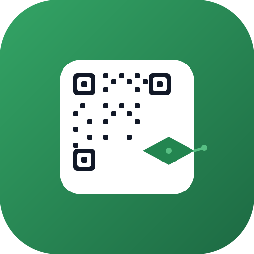

<p align="center">
  
</p>

<h1 align="center">UFERSA Mobile</h1>

<p align="center">
  Sua carteira universitária digital — QR do Restaurante Universitário, grade
  de horários, disciplinas, materiais e notas, 100% offline e no seu bolso.
</p>

<p align="center">
  
  
  
  <a href="LICENSE.md"></a>
  
</p>

<p align="center">
  <a href="#sobre">Sobre</a> ·
  <a href="#funcionalidades">Funcionalidades</a> ·
  <a href="#tecnologias">Tecnologias</a> ·
  <a href="#começando">Começando</a> ·
  <a href="#estrutura-do-projeto">Estrutura</a> ·
  <a href="#arquitetura">Arquitetura</a> ·
  <a href="#documentação">Documentação</a> ·
  <a href="#licença">Licença</a>
</p>

---

## Sobre

O **UFERSA Mobile** é um aplicativo pessoal para estudantes da Universidade
Federal Rural do Semi-Árido (UFERSA). Ele concentra em um único lugar o que o
aluno usa no dia a dia:

- o **QR code do RU** para almoçar/jantar no Restaurante Universitário;
- a **grade de horários** com disciplinas, eventos e provas;
- os **materiais de estudo** (PDFs, slides, listas de exercícios…) de cada
  disciplina;
- as **notas** e o acompanhamento do desempenho;
- os **links úteis** (SIGAA, Portal do Discente, site da UFERSA).

> **Importante:** este é um projeto **independente e não oficial**, criado
> por um estudante para uso pessoal. Não possui vínculo, endosso ou patrocínio
> da UFERSA.

### 100% offline, sem backend

O app foi desenhado para funcionar **sem internet** e **sem servidor**:

- todos os dados são locais (mock + `localStorage` + disco/IndexedDB);
- não há chamadas de rede, contas ou login;
- o **QR do RU é seu**: você faz upload da sua imagem de QR nas Configurações,
  e ela fica guardada apenas no seu dispositivo.

---

## Funcionalidades

- 🏠 **Início**: próximo evento com contagem regressiva, agenda do dia, links
  úteis com favicons locais e atalhos rápidos.
- 🗓️ **Grade de horários** — visual semanal:
  - disciplinas vinculadas, eventos avulsos e **provas** com destaque visual;
  - aulas do dia que já terminaram ficam esmaecidas;
  - edição completa por modais (criar, editar, excluir, conflitos avisados).
- 📝 **Disciplinas**:
  - cartões com professor, sala, carga horária e nota;
  - **materiais por disciplina**: importação em lote, renomear, categorizar,
    fixar (pin), reordenar manualmente, abrir, compartilhar e excluir;
  - **notas** por disciplina (0–10).
- 🍽️ **RU**: horários de almoço e jantar por campus (Mossoró, Angicos, Caraúbas,
  Pau dos Ferros) e **QR code** para uso no restaurante.
- 🔔 **Notificações locais**:
  - aulas (15 min antes), provas (no dia e na véspera) e aberturas do RU;
  - canais Android separados por categoria (aulas/provas/RU);
  - no APK funcionam **com o app fechado**; no navegador/PWA disparam com o
    app aberto (Web Notifications).
- 🎨 **Personalização**:
  - tema claro/escuro/sistema;
  - campus, QR do RU, links úteis personalizados;
  - perfil editável com foto (visualizador em tela cheia estilo WhatsApp).
- 💾 **Dados**:
  - backup/restore completo em um único JSON (grade, perfil, QR, links,
    materiais com binários);
  - "apagar todos os dados" com dupla confirmação.
- 👋 **Onboarding** no primeiro acesso: nome, curso e período antes de liberar
  o app.

---

## Tecnologias

| Camada            | Tecnologia                                                         |
| ----------------- | ------------------------------------------------------------------ |
| Frontend          | React 18, TypeScript (strict), Tailwind CSS 3 (dark mode via `.dark`) |
| Build             | Vite 6 + `vite-plugin-pwa`                                          |
| Aplicativo nativo | Capacitor 8 (`appId: br.edu.ufersa.mobile`)                         |
| Ícones            | lucide-react                                                       |
| Persistência      | `localStorage` + IndexedDB (web) / disco do app (APK)               |
| Ícones do app     | sharp (rasterização do `design/logo.svg`)                          |

Plugins nativos do Capacitor (arquivos, notificações, compartilhamento e
abertura de arquivos) são importados dinamicamente para não inflar o bundle
web.

---

## Começando

### Pré-requisitos

- **Node.js** 18+ e npm
- Para gerar o **APK**: Android SDK em `~/Android` (platform 36 + build-tools
  36) com `ANDROID_HOME` definido, e Java 17+.

### Instalação

```bash
npm install
```

### Desenvolvimento (navegador)

```bash
npm run dev
```

Abre o Vite dev server. O app também funciona como PWA — o service worker é
gerado apenas no build de produção.

### Build web / PWA

```bash
npm run build
npm run preview
```

O `dist/` é gerado com o PWA completo (manifest + service worker). Builds com
`base: './'`, prontos para hospedagem estática (o `vercel.json` já está
configurado para deploy na Vercel).

### APK Android

```bash
npm run build:android
```

Gera o APK debug em:

```
android/app/build/outputs/apk/debug/app-debug.apk
```

> ⚠️ **Primeiro build**: baixa o Gradle e as dependências (pode demorar
> bastante). Requer `ANDROID_HOME` apontando para o SDK.

---

## Estrutura do projeto

```
design/logo.svg          # fonte do logo (QR + capelo)
public/
  favicon.svg            # versão reduzida do logo
  icons/                 # icon-180/192/512/1024.png (PWA + iOS)
  favicons/              # favicons locais dos links úteis (offline)
src/
  App.tsx                # shell: tabs + modal de Configurações + gate de onboarding
  main.tsx               # entrada; monta App dentro de MaterialsProvider
  types/index.ts         # Student, Subject, ScheduleEntry, QuickLink, Material, Grade…
  data/                  # dados padrão/mock (subjects, schedule, qrCode, student, …)
  context/               # ScheduleContext, MaterialsContext, GradesContext (persistência)
  hooks/                 # useLocalStorage, useTheme, useProfile, useCampus, useNotificationSync…
  lib/                   # storage, fileStorage, backup, notifications, time, schedule…
  pages/                 # HomePage, SchedulePage, RuPage, SubjectsPage, SettingsPage, OnboardingPage
  components/            # BottomNavigation, modais, QRCodeDisplay, MaterialsSection…
android/                 # projeto Android (Capacitor)
```

---

## Arquitetura

- **Sem biblioteca de navegação/estado**: tabs controladas manualmente no
  `App.tsx`; estado via Context + `localStorage`.
- **Persistência unificada**: tudo passa por `src/lib/storage.ts` (prefixo
  `ufersa-mobile:`) ou `useLocalStorage`. Chaves antigas (`ufersa-pocket:`)
  são migradas automaticamente.
- **Materiais**: metadados em `localStorage`, binário no disco do app
  (Capacitor `Directory.Data/materials/{id}`) ou IndexedDB (web).
- **Notificações**: `useNotificationSync` reagenda tudo quando a grade, o
  campus ou as preferências mudam. No Android usa `AlarmManager` (funciona com
  app fechado); no navegador usa a Web Notifications API.
- **QR do RU**: por usuário — upload de imagem → data URL em `localStorage`.
  Sem imagem, mostra um QR mock.

Decisões de arquitetura detalhadas (e os porquês de cada uma) estão em
`AGENTS.md`.

---

## Documentação

| Documento                                  | Conteúdo                                          |
| ------------------------------------------ | ------------------------------------------------- |
| [`AGENTS.md`](AGENTS.md)                   | Guia de contexto do projeto para agentes/colaboradores |
| [`docs/ARCHITECTURE.md`](docs/ARCHITECTURE.md) | Arquitetura, fluxo de dados e decisões técnicas   |
| [`docs/STORAGE.md`](docs/STORAGE.md)       | Chaves de armazenamento e migrações                |
| [`docs/BUILDING.md`](docs/BUILDING.md)     | Build web, PWA, APK e regeneração de ícones        |
| [`CONTRIBUTING.md`](CONTRIBUTING.md)       | Como contribuir                                    |
| [`SECURITY.md`](SECURITY.md)               | Postura de segurança e relato de vulnerabilidades  |
| [`CHANGELOG.md`](CHANGELOG.md)             | Histórico de versões                               |

---

## Licença

Copyright © 2026 **Thierry de Andrade Fontes**. Todos os direitos reservados.

Este projeto tem uma **licença personalizada** — leia
[`LICENSE.md`](LICENSE.md) antes de usar. Em resumo:

- ✅ **Permitido**: uso **pessoal**, sem fins lucrativos e não institucional —
  sem autorização.
- ❌ **Exigem autorização prévia e por escrito do autor**: uso por
  **instituições** (universidades, empresas, órgãos públicos, ONGs…) e
  qualquer **uso comercial/lucrativo** (venda, SaaS, monetização).

> UFERSA é marca registrada da Universidade Federal Rural do Semi-Árido. Este
> é um projeto independente e **não oficial**, sem vínculo com a instituição.